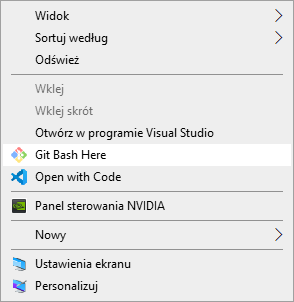

---
C# | Podstawy
---

# 1. Intro

Programowanie w języku **C#** nie wiąże się z koniecznością instalacji platformy **Visual Studio** - jak może się niektórym wydawać. Jej instalacja w celu pisania aplikacji konsolowych *"a tym będziemy się zajmować w tym kursie"* jest po prostu przerostem formy nad treścią.

Jeżeli pracujemy na systemie **Windows** na początku jak przystało na przyszłych pro-programistów ogarnijmy sobie konsole, którą możemy otwierać z dowolnego folderu. Fają opcją jest zainstalowanie sobie [klienta **GIT**](https://git-scm.com/download/win). Ma on wbudowaną konsole, a prędzej czy później będziemy wypadało korzystać  z tego narzędzia.

Żeby kompilować i uruchamiać kod **C#** musimy mieć zainstalowany pakiet. [**NET Core**](https://dotnet.microsoft.com/download).

Teraz wystarczy stworzyć folder z nazwą projektu oraz otworzyć w nim konsolę. 



Pozostaje wpisać dwie komendy. Pierwsza z nich tworzy projekt

    dotnet new console

W tym plik `Program.cs` na którym będziemy procować. Możemy otworzyć go notatnikiem, a następnie uruchomić drugą komendę

    dotnet run

Nasz program wyświetli

    Hello World!

Co jak nie trudno się domyśleć spowodowała obecność linijki 

```c#
Console.WriteLine("Hello World!");
```

Plik `Program.cs` można edytować nawet za pomocą notatnika, ale można się zamęczyć na śmierć. Idealnym narzędziem do tego jest [**Visual Studio Code**](https://code.visualstudio.com/). Jest to rozbudowany edytor tekstu, który świetnie sprawdza się w edytowaniu *wszystkiego*, wspiera *wszystko*, ma wbudowaną konsolę i jest po prostu genialny.

Polecam podczas instalacji zaznaczyć 2 checkbox-y. Jeden z dodaniem to menu kontekstowego przycisku z otwieraniem plików i folderów w **VSC**, a drugi z otwieraniem wszystkich wspieranych plików domyślnie za pomocą też za jego pomocą.

Jak prosto się domyśleć **VSC** nie *wspiera wszystkiego* tak z bomby. Wówczas instalka ważyłaby 100GB a nie niecałe 100MB. Żeby wygodnie pracować z **C#** musimy zainstalować odpowiednie rozszerzenia:

+ **C#** for Visual Studio Code
+ **C# FixFormat**
+ **Code Runner**

Na szczęście nie musimy ich szukać po Internecie. Nasz edytor ma wbudowany menażer rozszerzeń


Najgorsze za nami - mamy już wszystko żeby rozpocząć pracę!

# 2. Input - Output

Aplikacja konsolowa umieszczona jest w pewnej przestrzeni nazw `App` związanej z naszym projektem.
Po odpaleniu aplikacji wykonywana jest funkcja `Main` umieszczona w klacie `Program`.

```c#
using System;

namespace App
{
  class Program
  {
    static void Main(string[] args)
    {
      Console.WriteLine("Guantanamera!");
    }
  }
}
```
Jedynym zadaniem naszej aplikacji jest wypisanie tekstu:

    "Guantanamera!"

Z konsoli można także pobierać tekst wprowadzony przez użytkownika. Pozwala to tworzyć nieco bardziej użytkowe aplikacje.

```c#
Console.Write("Jak się nazwywasz? ");
string name = Console.ReadLine();

Console.WriteLine("Witaj " + name + "!");
```
Niestety, jeżeli chcemy wykorzystać wejściowy ciąg znaków w obliczeniach to będziemy musieli oddać ją konwersji.
Dzieje się tak dlatego, że wszystko co wprowadza użytkownik początkowo traktowane jest jako `string`.

```c#
double tax = 0.18;

Console.Write("Ile zł byś chciał zarabiać? ");
double pay = double.Parse(Console.ReadLine());

pay = pay * (1 - tax);
Console.WriteLine("Niestety po odprowadzeniu podatku zostanie ci " + pay + " zł");
```
W przypadku wyświetlenia następuje domyślna konwerersja z `int` na `string`.
W **C#** przyjęto konwencje, że konwersje związane z utratą danych trzeba wykonać ręcznie,
natomiast w przypadku, gdy nie tracimy danych konwersje wykonywane są automatycznie

Konwersje automatyczne: `char` ⟶ `int` ⟶ `long` ⟶ `double` ⟶ `string`

Konwersje ręczne: `string` ⟶ `double` ⟶ `long` ⟶ `int` ⟶ `char`

# 3. Switch...Case

Instrukcja `switch` stosujemy wówczas gdy chcemy przeskoczyć do odpowiedniego miejsca w kodzie oznaczonego jako `case`
w zależności od wartości jaką przyjmuje zmienna `option`.

```c#
switch(option) 
{
  case x:
    // option x
    break;
  case y:
    // option y
    break;
  default:
    // default options
    break;
}
```

W przykładzie w zależności od zmiennej `day` ma wyświetlić się nazwa dnia tygodnia, na który wskazuje.

```c#
int day = 4;
switch(day) 
{
  case 1:
    Console.WriteLine("Dziś jest poniedziałek");
    break;
  case 2:
    Console.WriteLine("Dziś jest wtorek");
    break;
  case 3:
    Console.WriteLine("Dziś jest środa");
    break;
  case 4:
    Console.WriteLine("Dziś jest czwartek");
    break;
  case 5:
    Console.WriteLine("Dziś jest piątek");
    break;
  case 6:
    Console.WriteLine("Dziś jest sobota");
    break;
  case 0: case 7:
    Console.WriteLine("Dziś jest niedziela");
    break;
}
```
W znacznej większości języków programowania indeksowanie zaczyna się od `0`, jednak dni tygodnia wydają się wyjątkiem, ponieważ w wielu państwach pierwszym dniem tygodnia jest niedziela. Zatem w przykładzie, zarówno dla `day == 0`, jak i dla `day == 7` zostaniemy poinformowani, że jest niedziela. Jest to możliwe ponieważ kilka `case`-ów  może prowadzić do tego samego miejsca w kodzie.

Widzimy, że po każdym bloku kodu dla każdej opcji znajduje się instrukcji `break`. Instrukcja to wymusza wyjście z instrukcji 'switch', a także pętki takich jak `while`, czy `for`. Zamiast instrukcji `break` możemy użyć `goto case`, które spowoduje przeskoczeni do odpowiedniego `case`-a

```c#
int day = 4;
switch (day)
{
  case 1:
    Console.WriteLine("Do weekendy jeszcze trzeba przeżyć poniedziałek");
    goto case 2;
  case 2:
    Console.WriteLine("Do weekendy jeszcze trzeba przeżyć wtorek");
    goto case 3;
  case 3:
    Console.WriteLine("Do weekendy jeszcze trzeba przeżyć środę");
  goto case 4;
    case 4:
    Console.WriteLine("Do weekendy jeszcze trzeba przeżyć czwartek");
    goto case 5;
  case 5:
    Console.WriteLine("Do weekendy jeszcze trzeba przeżyć piątek");
    break;
  default:
    Console.WriteLine("Weekend trwa w najlepsze!");
    break;
}
```

# 4. Operatory arytmetyczne

Pobierzmy z konsoli zmienną `x` oraz `y`, a następnie wykonajmy operacje arytmetyczną, którą wskaże użytkownik.

|   Nazwa            | Operator | Przykłady | Z przypisaniem |
|--------------------|:--------:|-----------|----------------|
| Dodawanie          | `+`      | x = x + y | x += y         |
| Odejmopwanie       | `-`      | x = x - y | x -= y         |
| Mnożenie           | `*`      | x = x * y | x *= y         |
| Dzielenie          | `/`      | x = x / y | x /= y         |
| Reszta z dzielenia | `%`      | x = x % y | x /= y         |
| Inkrementacja      | `++`     | x++       | x += 1         |
| Dekrementacja      | `--`     | x--       | x -= 1         |

```c#
Console.Write("Podaj zmienną x: ");
int x = int.Parse(Console.ReadLine());

Console.Write("Podaj zmienną y: ");
int y = int.Parse(Console.ReadLine());

Console.Write("Podaj operację jaką chcesz wykonać ['+','-','*','/']:");
string option = Console.ReadLine();

switch(option)
{
  case "+": x = x + y; break;
  case "-": x = x - y; break;
  case "*": x = x * y; break;
  case "/": x = x / y; break;
  default: 
    Console.WriteLine("Nieobsługiwana operacja!");
    return;
}

Console.WriteLine("Wynik operacji: x " + option + " y = " + x);

```
Wszystko działa OK, jednak gdy `x = 20`, a `y = 3` i wybierzemy instrukcję `'/'` naszym oczą ukaże się rezultat

    Podaj zmienną x: 20
    Podaj zmienną y: 3
    Podaj operację jaką chcesz wykonać ['+','-','*','/']: /
    Wynik operacji: x / y = 6

Dzieje się tak dla tego, że zmienne na których pracujemy są typu 'int'
Wystarczy zmienić je na `double` i problem rozwiązany

```c#
Console.Write("Podaj zmienną x: ");
double x = double.Parse(Console.ReadLine());

Console.Write("Podaj zmienną y: ");
double y = double.Parse(Console.ReadLine());
```
    Wynik operacji: x / y = 6,666666666666667

# 5. If...Else

Instrukcja `switch...case` rewelacyjnie sprawdza się przy ograniczonej liczbie opcji. W przypadku, gdy opcji jest więcej, a niekiedy jest ich nieskończenie wiele to z pomocą przychodzi konstrukcja `if...else`

```c#
if(condition)
{
  // code for condition == true
} 
else if(second-condition) 
{
  // code for second-condition == true
} 
else
{
  // another case code
}
```

W języku `C#` warunek jest operacją logiczną. W przypadku prawdy jest wykonywany, natomiast w przypadku fałszu nie. W operacjach logicznych stosujemy operatory porównania

|   Nazwa        | Operator | Przykłady |
|----------------|:--------:|-----------|
| Równy          | `==`     | x == y    |
| Różny          | `!=`     | x != y    |
| Większy        | `>`      | x > y     |
| Mniejszy       | `<`      | x < y     |
| Większy-Równy  | `>=`     | x >= y    |
| Mniejszy-Równy | `<=`     | x <= y    |

```c#
Console.Write("Ile masz lat? ");
double age = double.Parse(Console.ReadLine());

if(age > 25)
{
  Console.WriteLine("Jesteś starym waflem");
}
else
{
  Console.WriteLine("Jeszcze możesz być głupi");
}
```

Załóżmy, że dla ludzi w wieku **od 2 do 7** lat oraz **od 26 do 30** przysługuje specjalne dofinansowanie.
Napiszmy program, gdzie podamy nasz wiek i wyświetli się czy dofinansowanie nam przysługuję. Do tego przydadzą nam się dodatkowe operatory logiczne. Za ich pomocą łączyć i negować operacje porównywania

|   Nazwa        | Operator | Skrót | Przykłady              | Rezultat      |
|----------------|:--------:|:-----:|------------------------|---------------|
| Suma logiczna  | `&&`     | AND   | `x > 2 && x <= 5`      | x ∈ ( 2 ; 5 〉 |
| Większy        | `\|\|`   | OR    | `x <= 2 \|\| x > 5`    | x ∈ ( 2 ; 5 〉 |
| Równy          | `!`      | NOT   | `!(x > 2 \|\| x <= 5)` | x ∈ ( 2 ; 5 〉 |

A... zmieńmy zdanie odnośnie 5 latków, którym jednak nie damy dofinansowania.

Zadaniem jakie sobie teraz wyznaczymy będzie obliczenie wartości funkcji w zależności od podanej wartości `x` dla **przebiegu A**

| przebieg A               | przebieg B               |
|:------------------------:|:------------------------:|
|   |   |

```c#
if(x < -2)
{
  y = -0.5 * x - 3;
}
else if(x < 1)
{
  y = ((double)4 / 3) * x + ((double)2 / 3);
}
else
{
  y = 2;
}
```

Zauważmy, że aby liczba była traktowana jako zmiennoprzecinkowa trzeba o tym poinformować kompilator. Realizuje się to za pomocą `(double)`.

Aby w program był w pełni funkcjonalny trzeba jeszcze:
 + dopisać deklaracje zmiennych `x`, `y`
 + dodać pobranie wartości `x` z konsoli
 + Wyświetlenie wartości `y` jako rezultat
 + Zająć się przebiegiem B

```c#
using System;

namespace workspace
{
  class Program
  {
    static void Main(string[] args)
    {
      Console.Write("Podaj wartość x: ");
      double x = double.Parse(Console.ReadLine());
      double y;

      if(x < -5)
      {
        y = 0.5 * x + 0.5;
      }
      else if(x < -2)
      {
        y = (1.44 * x * x) + (10 * x) + 16;
      }
      else if (x < 0)
      {
        y = Math.Sqrt(4 - x*x);
      }
      else if (x < 3)
      {
        y = 2;
      }
      else
      {
        y = -((double)3 / 4) * x + 5.25;
      }
      Console.WriteLine(y);
    }
  }
}
```

## Zadanie
Napisać program, który wylicza miejsca zerowe funkcji kwadratowej. Możesz tą funkcję pobrać od użytkownika jako zmienne `a`, `b`, `c` funkcji $y = ax^2 + bx + c$. Pamiętaj o sytuacjach, kiedy niektóre parametry będą miały wartość `0`, a wówczas funkcja przestaje być parabolą.

```c#
using System;

namespace workspace
{
  class Program
  {
    static void Main(string[] args)
    {
      Console.Write("a: ");
      double a = double.Parse(Console.ReadLine());

      Console.Write("b: ");
      double b = double.Parse(Console.ReadLine());

      Console.Write("c: ");
      double c = double.Parse(Console.ReadLine());

      double delta = (b*b) - 4*a*c;
      double x1, x2;

      if(a == 0)
      {
        if(b == 0)
        {
          if(c == 0) Console.WriteLine("Nieskończeni wiele rozwiązań");
          else Console.WriteLine("Brak rozwiązań");
          return;
        }

        x1 = c / b;
        Console.WriteLine("x = " + x1);
        return;
      }

      if(delta > 0)
      {
        x1 = (-b + Math.Sqrt(delta)) / (2 * a);
        x2 = (-b - Math.Sqrt(delta)) / (2 * a);

        Console.WriteLine("x1 = " + x1);
        Console.WriteLine("x2 = " + x2);
      }
      else if(delta == 0)
      {
        x1 = -b / (2 * a);
        Console.WriteLine("x = " + x1);
      }
      else
      {
        Console.WriteLine("Brak rozwiązań");
      }
    }
  }
}
```