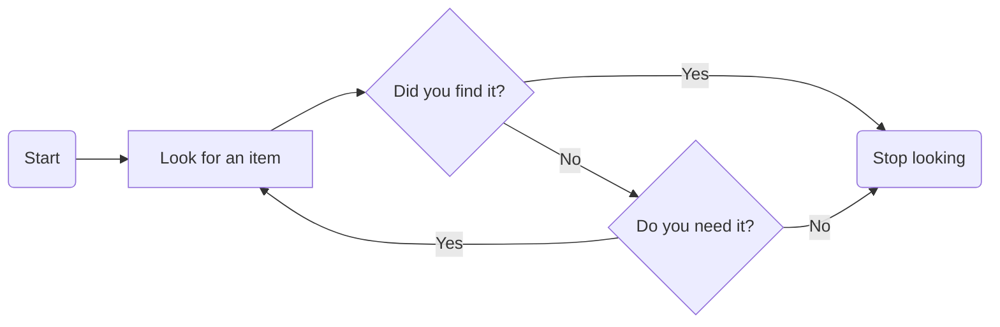

# c-hash

Uniwersytet Morski w Gdyni - Kurs podstawowy w języku C#

```mermaid
graph LR

A(Start)

A --> B[Look for an item]

B --> C{Did you find it?}
C -->|Yes| D(Stop looking)
C -->|No| E{Do you need it?}
E -->|Yes| B
E -->|No| D
```