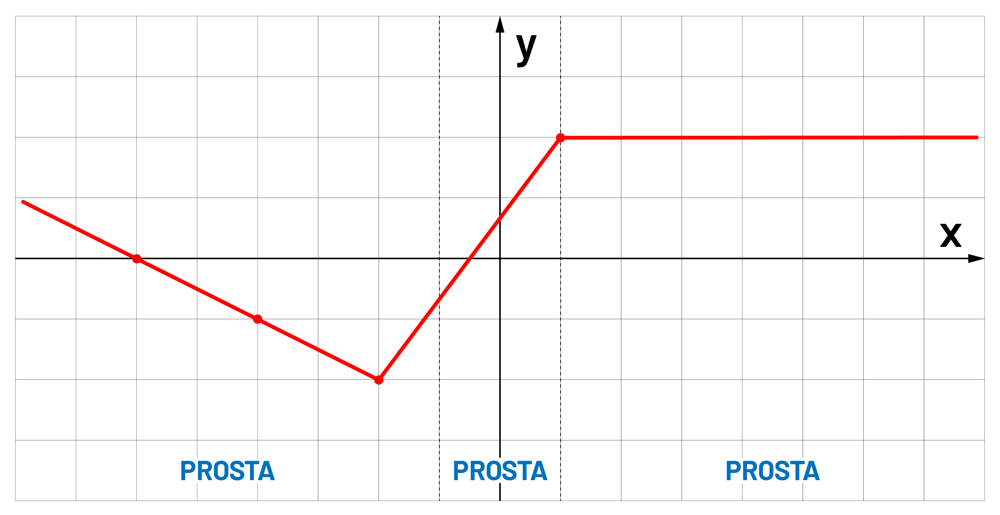

## ⚓ Content

- 1\. [Environment](#1-environment-) - Konfiguracja środowiska
- 2\. [Input-Output](#2-input-output-) - Wejście i wyjście konsoli
- 3\. [Switch-Case](#3-switch-case-) - Warunek wielokrotnego wyboru
- 4\. [Arithmetic operators](#4-arithmetic-operators-) - Operacje arytmetyczne
- 5\. [If-Else](#5-if-else-) - Instrukcje warunkowe
- 6\. [While-For](#6-while-for-) - Pętle
- 7\. [Arrays](#7-arrays-) - Tablice
- 8\. [Arguments](#8-argumenty-) - Argumenty z konsoli
- 9\. [Date](#9-date-) - Data i godzina
- 10\. [Files](#10-files-) - Operacje na plikach
- 11\. [Regular expression](#11-Regular-expression-) - Wyrażenia regularne

# 1. Environment [➥](#-content)

Programowanie w języku **C#** nie wiąże się z koniecznością instalacji platformy **Visual Studio** - jak może się niektórym wydawać. Jej instalacja w celu pisania aplikacji konsolowych _"a tym będziemy się zajmować w tym kursie"_ jest po prostu przerostem formy nad treścią.

Jeżeli pracujemy na systemie **Windows** na początku jak przystało na przyszłych pro-programistów ogarnijmy sobie konsole, którą możemy otwierać z dowolnego folderu. Fają opcją jest zainstalowanie sobie [klienta **GIT**](https://git-scm.com/download/win). Ma on wbudowaną konsole, a prędzej czy później będziemy wypadało korzystać z tego narzędzia.

Żeby kompilować i uruchamiać kod **C#** musimy mieć zainstalowany pakiet [**.NET** SDK x64](https://dotnet.microsoft.com/download).

Teraz wystarczy stworzyć folder z nazwą projektu oraz otworzyć w nim konsolę.


Pozostaje wpisać dwie komendy. Pierwsza z nich tworzy projekt

    dotnet new console

W tym plik `Program.cs` na którym będziemy pracować. Możemy otworzyć go notatnikiem, a następnie uruchomić drugą komendę

    dotnet run

Nasz program wyświetli

    Hello World!

Co jak nie trudno się domyśleć spowodowała obecność linijki

```c#
Console.WriteLine("Hello World!");
```

Plik `Program.cs` można edytować nawet za pomocą notatnika, ale można się zamęczyć na śmierć. Idealnym narzędziem do tego jest [**Visual Studio Code**](https://code.visualstudio.com/). Jest to rozbudowany edytor tekstu, który świetnie sprawdza się w edytowaniu _wszystkiego_, wspiera _wszystko_, ma wbudowaną konsolę i jest po prostu genialny.

Polecam podczas instalacji zaznaczyć 2 checkbox-y. Jeden z dodaniem to menu kontekstowego przycisku z otwieraniem plików i folderów w **VSC**, a drugi z otwieraniem wszystkich wspieranych plików domyślnie za pomocą też za jego pomocą.

Jak prosto się domyśleć **VSC** nie _wspiera wszystkiego_ tak z bomby. Wówczas instalka ważyłaby 100GB a nie niecałe 100MB. Żeby wygodnie pracować z **C#** musimy zainstalować odpowiednie rozszerzenia:

- **C#** for Visual Studio Code
- **Prettier - Code formatter** - Simon Siefke
- **Code Runner**

Na szczęście nie musimy ich szukać po Internecie. Nasz edytor ma wbudowany menażer rozszerzeń


Najgorsze za nami - mamy już wszystko żeby rozpocząć pracę!

# 2. Input-Output [➥](#-content)

Aplikacja konsolowa umieszczona jest w pewnej przestrzeni nazw `App` związanej z naszym projektem.
Po odpaleniu aplikacji wykonywana jest funkcja `Main` umieszczona w klacie `Program`.

```c#
using System;

namespace App
{
  class Program
  {
    static void Main(string[] args)
    {
      Console.WriteLine("Guantanamera!");
    }
  }
}
```

Jedynym zadaniem naszej aplikacji jest wypisanie tekstu:

    "Guantanamera!"

Z konsoli można także pobierać tekst wprowadzony przez użytkownika. Pozwala to tworzyć nieco bardziej użytkowe aplikacje.

```c#
Console.Write("Jak się nazwywasz? ");
string name = Console.ReadLine();

Console.WriteLine("Witaj " + name + "!");
```

Niestety, jeżeli chcemy wykorzystać wejściowy ciąg znaków w obliczeniach to będziemy musieli oddać ją konwersji.
Dzieje się tak dlatego, że wszystko co wprowadza użytkownik początkowo traktowane jest jako `string`.

```c#
double tax = 0.18;

Console.Write("Ile zł byś chciał zarabiać? ");
double pay = double.Parse(Console.ReadLine());

pay = pay * (1 - tax);
Console.WriteLine("Niestety po odprowadzeniu podatku zostanie ci " + pay + " zł");
```

W przypadku wyświetlenia następuje domyślna konwerersja z `int` na `string`.
W **C#** przyjęto konwencje, że konwersje związane z utratą danych trzeba wykonać ręcznie,
natomiast w przypadku, gdy nie tracimy danych konwersje wykonywane są automatycznie

Konwersje automatyczne: `char` ⟶ `int` ⟶ `long` ⟶ `double` ⟶ `string`

Konwersje ręczne: `string` ⟶ `double` ⟶ `long` ⟶ `int` ⟶ `char`

Wiedząc jak pobrać zmienną od urzytkownika, pobierz `x` oraz oblicz wartość funkcji.

=\frac{x^{\pi/2}}{log_{10}(sqrt(\pi))}%2B2cos^2(x)e^{x}>)

Wyświetl ją z dokładnością do 4 miejsc po przecinku za pomocą linii kodu.

```c#
Console.WriteLine("{0:#.####}", x);
```

Z pewnością pomocna okarze się przygotowana klasa `Math`, którą zawiera między innymi:

```c#
Math.PI // π
Math.Pow(x, 2.0) // x^2
Math.Sqrt(x)
Math.Cos(x)
Math.Log10(x)
Math.Exp(x) // e^x
```

# 3. Switch-Case [➥](#-content)

Instrukcja `switch` stosujemy wówczas gdy chcemy przeskoczyć do odpowiedniego miejsca w kodzie oznaczonego jako `case`
w zależności od wartości jaką przyjmuje zmienna `option`.

```c#
switch(option)
{
  case x:
    // option x
    break;
  case y:
    // option y
    break;
  default:
    // default options
    break;
}
```

W przykładzie w zależności od zmiennej `day` ma wyświetlić się nazwa dnia tygodnia, na który wskazuje.

```c#
int day = 4;
switch(day)
{
  case 1:
    Console.WriteLine("Dziś jest poniedziałek");
    break;
  case 2:
    Console.WriteLine("Dziś jest wtorek");
    break;
  case 3:
    Console.WriteLine("Dziś jest środa");
    break;
  case 4:
    Console.WriteLine("Dziś jest czwartek");
    break;
  case 5:
    Console.WriteLine("Dziś jest piątek");
    break;
  case 6:
    Console.WriteLine("Dziś jest sobota");
    break;
  case 0: case 7:
    Console.WriteLine("Dziś jest niedziela");
    break;
}
```

W znacznej większości języków programowania indeksowanie zaczyna się od `0`, jednak dni tygodnia wydają się wyjątkiem, ponieważ w wielu państwach pierwszym dniem tygodnia jest niedziela. Zatem w przykładzie, zarówno dla `day == 0`, jak i dla `day == 7` zostaniemy poinformowani, że jest niedziela. Jest to możliwe ponieważ kilka `case`-ów może prowadzić do tego samego miejsca w kodzie.

Widzimy, że po każdym bloku kodu dla każdej opcji znajduje się instrukcji `break`. Instrukcja to wymusza wyjście z instrukcji `switch`, a także pętki takich jak `while`, czy `for`. Zamiast instrukcji `break` możemy użyć `goto case`, które spowoduje przeskoczeni do odpowiedniego `case`-a

```c#
int day = 4;
switch (day)
{
  case 1:
    Console.WriteLine("Do weekendy jeszcze trzeba przeżyć poniedziałek");
    goto case 2;
  case 2:
    Console.WriteLine("Do weekendy jeszcze trzeba przeżyć wtorek");
    goto case 3;
  case 3:
    Console.WriteLine("Do weekendy jeszcze trzeba przeżyć środę");
  goto case 4;
    case 4:
    Console.WriteLine("Do weekendy jeszcze trzeba przeżyć czwartek");
    goto case 5;
  case 5:
    Console.WriteLine("Do weekendy jeszcze trzeba przeżyć piątek");
    break;
  default:
    Console.WriteLine("Weekend trwa w najlepsze!");
    break;
}
```

# 4. Arithmetic operators [➥](#-content)

Pobierzmy z konsoli zmienną `x` oraz `y`, a następnie wykonajmy operacje arytmetyczną, którą wskaże użytkownik.

| Nazwa              | Operator | Przykłady  | Z przypisaniem |
| ------------------ | :------: | ---------- | -------------- |
| Dodawanie          |   `+`    | x = x + y  | x += y         |
| Odejmopwanie       |   `-`    | x = x - y  | x -= y         |
| Mnożenie           |   `*`    | x = x \* y | x \*= y        |
| Dzielenie          |   `/`    | x = x / y  | x /= y         |
| Reszta z dzielenia |   `%`    | x = x % y  | x /= y         |
| Inkrementacja      |   `++`   | x++        | x += 1         |
| Dekrementacja      |   `--`   | x--        | x -= 1         |

```c#
Console.Write("Podaj zmienną x: ");
int x = int.Parse(Console.ReadLine());

Console.Write("Podaj zmienną y: ");
int y = int.Parse(Console.ReadLine());

Console.Write("Podaj operację jaką chcesz wykonać ['+','-','*','/']:");
string option = Console.ReadLine();

switch(option)
{
  case "+": x = x + y; break;
  case "-": x = x - y; break;
  case "*": x = x * y; break;
  case "/": x = x / y; break;
  default:
    Console.WriteLine("Nieobsługiwana operacja!");
    return;
}

Console.WriteLine("Wynik operacji: x " + option + " y = " + x);

```

Wszystko działa OK, jednak gdy `x = 20`, a `y = 3` i wybierzemy instrukcję `'/'` naszym oczą ukaże się rezultat

    Podaj zmienną x: 20
    Podaj zmienną y: 3
    Podaj operację jaką chcesz wykonać ['+','-','*','/']: /
    Wynik operacji: x / y = 6

Dzieje się tak dla tego, że zmienne na których pracujemy są typu `int`
Wystarczy zmienić je na `double` i problem rozwiązany

```c#
Console.Write("Podaj zmienną x: ");
double x = double.Parse(Console.ReadLine());

Console.Write("Podaj zmienną y: ");
double y = double.Parse(Console.ReadLine());
```

    Wynik operacji: x / y = 6,666666666666667

Wartość `option` to zaledwie jeden znak, więc zadeklarujmy go jako `char`. Będzie to wymagało dodatkowego `Parse`-owania oraz zamiany cudzysłowów podwójnych `"` na pojedyncze `'` w `case`-ach.

Zamieńmy też operacje arytmetyczne na ich skrócone wersje oraz

# 5. If-Else [➥](#-content)

Instrukcja `switch...case` rewelacyjnie sprawdza się przy ograniczonej liczbie opcji. W przypadku, gdy opcji jest więcej, a niekiedy jest ich nieskończenie wiele to z pomocą przychodzi konstrukcja `if...else`

```c#
if(condition)
{
  // code for condition == true
}
else if(second-condition)
{
  // code for second-condition == true
}
else
{
  // another case code
}
```

W języku `C#` warunek jest operacją logiczną. W przypadku prawdy jest wykonywany, natomiast w przypadku fałszu nie. W operacjach logicznych stosujemy operatory porównania

| Nazwa          | Operator | Przykłady |
| -------------- | :------: | --------- |
| Równy          |   `==`   | x == y    |
| Różny          |   `!=`   | x != y    |
| Większy        |   `>`    | x > y     |
| Mniejszy       |   `<`    | x < y     |
| Większy-Równy  |   `>=`   | x >= y    |
| Mniejszy-Równy |   `<=`   | x <= y    |

```c#
Console.Write("Ile masz lat? ");
double age = double.Parse(Console.ReadLine());

if(age > 25)
{
  Console.WriteLine("Jesteś starym waflem");
}
else
{
  Console.WriteLine("Jeszcze możesz być głupi");
}
```

Załóżmy, że dla ludzi w wieku **od 2 do 7** lat oraz **od 26 do 30** przysługuje specjalne dofinansowanie.
Napiszmy program, gdzie podamy nasz wiek i wyświetli się czy dofinansowanie nam przysługuję. Do tego przydadzą nam się dodatkowe operatory logiczne. Za ich pomocą łączyć i negować operacje porównywania

| Nazwa                | Operator | Skrót | Przykłady              | Rezultat       |
| -------------------- | :------: | :---: | ---------------------- | -------------- |
| Suma logiczna        |   `&&`   |  AND  | `x > 2 && x <= 5`      | x ∈ ( 2 ; 5 〉 |
| Alternatywa logiczna |  `\|\|`  |  OR   | `x <= 2 \|\| x > 5`    | x ∈ ( 2 ; 5 〉 |
| Negacja              |   `!`    |  NOT  | `!(x > 2 \|\| x <= 5)` | x ∈ ( 2 ; 5 〉 |

```c#
Console.Write("Ile masz lat? ");
double age = double.Parse(Console.ReadLine());

if((age >= 2 && age <= 7) || (age >= 26 && age <= 30))
  Console.WriteLine("Otrzymasz dofinansowanie - Jupi :)");
else
  Console.WriteLine("Nie będzie piniążków :(");
```

A... zmieńmy zdanie odnośnie 5 latków, którym jednak nie damy dofinansowania.

```c#
Console.Write("Ile masz lat? ");
double age = double.Parse(Console.ReadLine());

if(((age >= 2 && age <= 7) || (age >= 26 && age <= 30)) && age != 5)
  Console.WriteLine("Otrzymasz dofinansowanie - Jupi :)");
else
  Console.WriteLine("Nie będzie piniążków :(");
```

Zadaniem jakie sobie teraz wyznaczymy będzie obliczenie wartości funkcji w zależności od podanej wartości `x` dla **przebiegu A**

|     przebieg **A**      |     przebieg **B**      |
| :---------------------: | :---------------------: |
|  |  |

|     przebieg **C**      |     przebieg **D**      |
| :---------------------: | :---------------------: |
|  |  |

```c#
if(x < -2)
{
  y = -0.5 * x - 3;
}
else if(x < 1)
{
  y = ((double)4 / 3) * x + ((double)2 / 3);
}
else
{
  y = 2;
}
```

Zauważmy, że aby liczba była traktowana jako zmiennoprzecinkowa trzeba o tym poinformować kompilator. Realizuje się to za pomocą `(double)`. Można także zamiast `4` napisać `4.0`.

Aby w program był w pełni funkcjonalny trzeba jeszcze:

- dopisać deklaracje zmiennych `x`, `y`
- dodać pobranie wartości `x` z konsoli
- Wyświetlenie wartości `y` jako rezultat
- Zająć się przebiegami **A** i **B** . W przebiegu **C** można użyć tylko jednej instrukcji `if` - bez `if else`

Przebieg B:

```c#
using System;

namespace workspace
{
  class Program
  {
    static void Main(string[] args)
    {
      Console.Write("Podaj wartość x: ");
      double x = double.Parse(Console.ReadLine());
      double y;

      if(x < -5)
      {
        y = 0.5 * x + 0.5;
      }
      else if(x < -2)
      {
        y = (1.44 * x * x) + (10 * x) + 16;
      }
      else if (x < 0)
      {
        y = Math.Sqrt(4 - x * x);
      }
      else if (x < 3)
      {
        y = 2;
      }
      else
      {
        y = -((double)3 / 4) * x + 4.25;
      }
      Console.WriteLine(y);
    }
  }
}
```

## ⭐ Zadanie 1

Napisać program, który wylicza miejsca zerowe funkcji kwadratowej. Możesz tą funkcję pobrać od użytkownika jako zmienne `a`, `b`, `c` funkcji:  Pamiętaj o sytuacjach, kiedy niektóre parametry będą miały wartość `0`, a wówczas funkcja przestaje być parabolą.

Rozwiązanie:

```c#
using System;

namespace workspace
{
  class Program
  {
    static void Main(string[] args)
    {
      Console.Write("a: ");
      double a = double.Parse(Console.ReadLine());

      Console.Write("b: ");
      double b = double.Parse(Console.ReadLine());

      Console.Write("c: ");
      double c = double.Parse(Console.ReadLine());

      double delta = b * b - (4 * a *c);
      double x1, x2;

      if(a == 0)
      {
        if(b == 0)
        {
          if(c == 0) Console.WriteLine("Nieskończeni wiele rozwiązań");
          else Console.WriteLine("Brak rozwiązań");
          return;
        }
        x1 = c / b;
        Console.WriteLine("x = " + x1);
        return;
      }

      if(delta > 0)
      {
        x1 = (-b + Math.Sqrt(delta)) / (2 * a);
        x2 = (-b - Math.Sqrt(delta)) / (2 * a);

        Console.WriteLine("x1 = " + x1);
        Console.WriteLine("x2 = " + x2);
      }
      else if(delta == 0)
      {
        x1 = -b / (2 * a);
        Console.WriteLine("x = " + x1);
      }
      else
      {
        Console.WriteLine("Brak rozwiązań");
      }
    }
  }
}
```

# 6. While-For [➥](#-content)

Najbardziej podstawową pętlą jest pętla `while`. Wystarczy zawrzeć wewnątrz `()` warunek i do puki jest on spełniony pętla będzie wykonywana. W przykładnie wypiszemy liczby **od 0 do 9**

```c#
Console.Write("i: ");
int end = int.Parse(Console.ReadLine());
int i = 0;
while(i < end)
{
  Console.Write(i + " ");
  i++;
}
```

Aby kod z pętli zawsze przynajmniej raz został wykonany (nie zalaeżnie od warunku) trzeba użyć konstrukcji `do..while`:

```c#
do
{
  Console.Write(i + " ");
  i++;
}
while(i < end);
```

Nawet gdy i będzie większe od 10 to jego wartość wyświetli się na konsoli chociaż raz.

W przypadku iteracji pętle **while** możemy zastąpić pętlą **for**. Wówczas składnia takiej operacji się nieco upraszcza.

```c#
one-tine-executed;
while(condition)
{
  // [...]
  every-time-executed;
}

for(one-tine-executed; condition; every-time-executed)
{
  // [...]
}
```

```c#
int i = 0;
while(i < 10)
{
  Console.Write(i + " ");
  i++;
}

for(int i = 0; i < 10; i++)
{
  Console.Write(i + " ");
}
```

Gdy chcemy zakończyć działanie pętli w sytuacji, której nie przewiduje warunek możemy tego dokonać za pomocą instrukcji `break`

```c#
for(int i = 0; i < 10; i++)
{
  if(i == 3) break;
  Console.Write(i + " ");
}
```

Wówczas zostanie wyświetlone

    0 1 2

Aby pominąć iteracje dla pojedynczego przypadku, bez wyjści z pętli można użyć instukcji `continue`.

```c#
for(int i = 0; i < 10; i++)
{
  if(i == 3) continue;
  Console.Write(i + " ");
}
```

Wówczas zostanie wyświetlone

    0 1 2 4 5 6 7 8 9

Mając tą wiedze napisanie programu, który pobierze od użytkownika liczby `start` i `end` typu `int` oraz wyświetli kolejne liczby zaczynając do `start`, a kończąc na `end`.

Jak użyłem do tego zadania pętli `for` zmień go tak, aby wykorzystać pętle `while`. Gdy użyłeś `while` przkształć go tak, aby teraz użyć `for`.

Pętla `while`:

```c#
Console.Write("start: ");
int start = int.Parse(Console.ReadLine());
Console.Write("end: ");
int end = int.Parse(Console.ReadLine());

while(start != end)
{
  Console.Write(start + " ");
  if(start > end) start--;
  else start++;
}
Console.Write(start + " ");
```

Pętla `for`:

```c#
Console.Write("start: ");
int start = int.Parse(Console.ReadLine());
Console.Write("end: ");
int end = int.Parse(Console.ReadLine());

if(start < end)
{
  for(int i = start; i <= end; i++)
    Console.Write(i + " ");
}
else
{
  for(int i = start; i >= end; i--)
    Console.Write(i + " ");
}
```

## ⭐ Zadanie 2

Napisz program, który losuje liczbę od 0 do 999 i pozwala użytkownikowi na podanie liczby. Po jej podaniu informuje użytkownika czy podana liczba jest większa, czy mniejsza. W przypadku podania poprawnej liczby użytkownik jest o tym informowany, a program kończy zadanie. Przydatny może okazać się wiedza jak uzyskiwać liczby pseudolosowe:

```c#
Random rng = new Random();
int nbr = rng.Next() % (max + 1);
Console.WriteLine(nbr);
```

Następnie można zmodyfikować program tak, aby wartość początkowa i końcowa przedziału też były ustawiane losowo, ale w granicach rozsądku 😁
Powiedzmy, że nasze liczby mają być czterocyfrowe a przedział minimalnie ma wynośić 1000.
Aby losować liczby z danego przedziału trzeba nieco bardzeij zmodyfikować wartość wylosowaną:

```c#
int nbr = min + (rng.Next() % (max + 1 - min));
```

## ⭐ Zadanie 3

Napisać program, który wylicza wypisuje liczby pierwsze od 2 do podanej przez użytkownika liczby. Liczby pierwsze są podzielne przez 1 i samą siebie. Warto skorzystać z Sita Eratostenesa.

<!---
Rozwiązanie:

```c#
Console.Write("End: ");

int end = int.Parse(Console.ReadLine());
bool flag;

for(int i = 1; i <= end; i++)
{
  flag = true;
  for (int j = 2; j <= Math.Sqrt(i); j++)
  {
    if(i % j == 0)
    {
      flag = false;
      break;
    }
  }
  if(flag == true) Console.Write(i + " ");
}
```
-->

# 7. Arrays [➥](#-content)

Tablice możemy zadeklarować na 2 sposoby.
Deklarując pustą tablicę o długości `n`.

```c#
double[] nbr = new double[n];
```

Wprowadzając do tablicy konkretne wartości

```c#
double[] nbr = { 12, 45, 56.5, 8, 94 };
```

Wypisanie wszystkich elementów tablicy można zrealizować oczywiście za pomocą pętli `for`

```c#
for(int i = 0; i < nbr.Length; i++)
  Console.WriteLine("nbr[" + i + "] = " + nbr[i]);
```

    nbr[0] = 12
    nbr[1] = 45
    nbr[2] = 56,5
    nbr[3] = 8
    nbr[4] = 94

Jednak, gdy nie jest potrzebny nam index tablicy, to bardziej elegancko użyć jest pętli `foreach`.

```c#
foreach(double nbr_i in nbr)
    Console.Write(nbr_i + " ");
```

    12 45 56,5 8 94

W tej pętli deklarowana jest zmienna pomocnicza. W naszym przypadku `nbr_i` i podczas kolejnych iteracji umieszczane w nim są kolejne elementy z tablicy.

Jak już torszkę ogarniamy pętle i tablicę można by napisać program, który pobiera od użytkownika długość tablicy, a następnie wszystkie jej elementy. W zależności od wybranej operacji wykona ją na całej podanej tablicy, a na końcu wyrzuci na konsolę tablicę wynikową.

Pierzym krokiem będzie pobranie operacji arytmentycznej podanej przez użytkownika (`+`, `-`, `*`, `/`) oraz liczby z kają ta operacja ma być wykonana.

Opracj ma być wykonana na wszystkich elementach tablicy podanej przez użytkownika. Przykładowo dla dodawania:

```c#
for(int i = 0; i < n; i++) arr[i] += y
```

Gdzie `y` jest liczbą podaną przez użytkownika.

```c#
Console.Write("Length: ");
int n = int.Parse(Console.ReadLine());

double[] arr = new double[n];

for(int i = 0; i < n; i++)
{
  Console.Write("Element[" + i + "]: ");
  arr[i] = double.Parse(Console.ReadLine());
}

// TODO:

Console.Write("Output:");
for(int i = 0; i < n; i++)
{
  Console.Write(" " + arr[i]);
}
```

Kolejnym krokiem będzie zmiana sposobu wprowadzania liczb przez użytkownika. Użytkownik poda łańcuch liczb oddzielonych spacjami. Przykładowo.

    12 45 56.5 8 94

Naszym zadaniem będzie przkształcenie tego łańcucha znaków na tablicę typu double.

```c#
{ 12 45 56.5 8 94 }
```

Do realizaji tego zadania pomocna może okazać się metoda `Split`

```c#
string str = Console.ReadLine();
String[] list = str.Split(" ");
```

```c#
double[] table = Array.ConvertAll(str.Split(mychars), new Converter<string, double>(double.Parse));
```

Następne zadanie będzie polegało na stworzeniu tablicy liczb oraz znalezieniu w niej wartości największej, najmniejszej oraz policzenie średniej. Być może okaże się pomocne ustawienie zmiennej na wartość `∞`/`-∞`

```c#
double positive = double.PositiveInfinity;
double negative = double.NegativeInfinity;
```

## ⭐ Zadanie 4

Wypełnić `n` elementową tablicę losowymi wartościami od **0** do **99**. Wyświetlić jej zawartość, gdzie `n` jest podawane przez użytkownika. Nastpnie posortowac za pomocą dowolnego algorytmu sortowania.

## ⭐ Zadanie 5

Program wypisujący liczby peirwsze - poprzednie zadanie:

Program taki jest dość wolny podczas szukania bardzo dużych liczb pierwszych. Dlatego, żeby go przyspieszyć będziemy zapisywać znalezione liczby pierwsze i sprawdzać dzielenie tylko przez liczby z tablicy. Ponieważ gdy liczba nie dzieli się przez wszystkie mniejsze od niej liczy pierwsze to tym bardziej nie dzieli się przez ich wielokrotności. Do dzieła!

<!---
Rozwiązanie:

```c#
Console.Write("End: ");

int end = int.Parse(Console.ReadLine());
bool flag;
int[] array = new int[1000];
int k = 0;

for(int i = 2; i <= end; i++)
{
  flag = true;
  for(int j = 0; j < k; j++)
  {
    if(i % array[j] == 0)
    {
      flag = false;
      break;
    }

    if(Math.Sqrt(array[j]) > i) break;
  }

  if(flag == true)
  {
    array[k] = i;
    k++;
  }
}

for(int i = 0; i < k; i++) Console.Write(array[i] + " ");
```
-->

# 8. Arguments [➥](#-content)

Przechwytywanie ciągów znaków od użytkownika to zaledwie jedna z opcji pobierania danych wejściowych - w dodatku w przypadku programów serwerowych bardzo mało praktyczna, a jako aplikacje użytkowe znacznie lepiej sprawdza się **GUI**. Przy relatywnie małej ilości inputów fajnie wykorzystać argumenty wejściowe `type[] args` jako parametry dla naszych programów.

Domyślnie w projekcie argumenty traktowane są jako string.

```c#
static void Main(string[] args)
```

Lecz bardzo łatwo to zmienić

```c#
static void Main(int[] args)
```

Zmodyfikujmy nasz poprzedni program wykonujący wskazaną operację na tablicy tak, aby wszystkie informacje wejściowy były dostarczane jako argumenty.

Argumenty dostarcza się podczas uruchamiania programu:

    dotnet run [args]

W naszym przypdaku

    dotnet run {y} {mode} [x-array]

```c#
if(args.Length < 3) return;

double[] x = new double[args.Length - 2];
double y = double.Parse(args[0]);
string opt = args[1];

for(int i = 0; i < args.Length; i++)
{
  x[i] = double.Parse(args[i + 2]);
}
```

## ⭐ Zadanie 6

Oczywiście modyfikujemy program z liczbami pierwszymi, tak aby wykorzystać metodę pobierania zmiennych poprzez argumenty. Żeby jednak nie było za prosto teraz podajemy przedział z którego mają być wyświetlane liczby.

    dotnet run {min} {max}

Zamiast tablicy.

```c#
int[] array = new int[1000];
```

Lepiej użyć **listy**, ponieważ nie jesteśmy ograniczeni jej długością. Lista to taka dyamiczna tablica.

```c#
List<string> array = new List<string>();
```

# 9. Date [➥](#-content)

Operacje na datach są na tyle często wykonywane, że w każdym języku wysokopoziomowym jest przygotowana specjalna klasa, która prawdopodobnie zawiera większość niezbędnych funkcji. Język **C#** nie jest wyjątkiem.

```c#
DateTime date = new DateTime(2021, 12, 1, 12, 0, 0);
// year, month, day, hour, minute, second
```

Aby zmodyfikować datę można skorzystać z poniższych metod

```c#
DateTime dt1 = date.AddSeconds(30);
DateTime dt2 = date.AddMinutes(-5);
DateTime dt3 = date.AddHours(2);
DateTime dt4 = date.AddDays(7);
DateTime dt5 = date.AddMonths(-3);
DateTime dt6 = date.AddYears(1);
```

Podczas wyświetlania daty należy podać jej format

```c#
date.ToString("yyyy-MM-dd HH:mm:ss"); // 2021-12-01 12:00:00
```

## ⭐ Zadanie 7

Napisać program pobierający jako 2 pierwsze argumenty **datę** i **godzinę**. Na ich podstawie nadleży stworzyć obiekt `DateTime`. Kolejne wprowadzone argumenty będą modyfikatorami tego obiektu w składni: `{nbr}{unit}`. `{nbr}` jest liczbą (może być ujemne), a `{unit}` jedną z jednostek:
- `s` - sekunda
- `m` - minuta
- `h` - godzina
- `d` - dzień
- `mo` - miesiąc
- `y` - rok

Example:

    2021-12-01 12:00:00 -1d +30m
    >> 2021-11-30 12:30:00

# 10. Files [➥](#-content)

Aby korzystać w prostszy sposób z metod wczytywania i zapisu do plików dodajmy do przestrzeni nazw bibliotekę `System.IO`:

```c#
using System;
using System.IO;
```

Pliki możemy wczytywać i zapisywać jako całość - wówczas zawartość wczytywana jest do zmiennej typu `string`:

```c#
string text = File.ReadAllText("./data.csv"); // Load
Console.WriteLine(text); // Display
File.WriteAllText("./output.csv", text); // Save
```

Lub jako tablicę linii - wówczas zawartość wczytywana jest do tablicy typu `string`:

```c#
string[] lines = File.ReadAllLines("./data.csv"); // Load
foreach (string line in lines) Console.WriteLine(line); // Display
File.WriteAllLines("./output.csv", lines); // Save
```

Pora napisać program. Niech wczytuje plik w formacie [`data.csv`](data.csv). W pliku są 2 kolumny. Jedna z nich to prąd, a druga napięcie. Zadeklarujmy zatem dwie tablice i umieśćmy w nich wczytane dane. Na koniec odbudujmy plik `csv`.

```c#
string[] lines = File.ReadAllLines("./data.csv");

double[] I = new double[lines.Length];
double[] V = new double[lines.Length];
string[] temp = new string[2];

for(int i = 0; i < lines.Length; i++)
{
  temp = lines[i].Split(",");
  I[i] = double.Parse(temp[0].Replace(".", ","));
  V[i] = double.Parse(temp[1].Replace(".", ","));
}

string output = "";

for(int i = 0; i < lines.Length; i++)
  output += I[i] + ";" + V[i] + "\r\n";

output = output.Replace(",", ".");
output = output.Replace(";", ",");

File.WriteAllText("./output.csv", output);
```

Aplikacja taka wydaje się bezużyteczna jednaka, gdy dodamy dodatkowe obliczenia jak skalowanie, całkowanie to uzyskamy całkiem użyteczną aplikację.

## ⭐ Zadanie 8

Mając przebiegi prądu i napięcia dodaj charakterystykę mocy chwilowej oraz umieść ją w wyjściowym pliku `.csv`. Wszystkie trzy przebiegi wyświetlić za pomocą dowolnego oprogramowania _(może być excel)_

# 11 Regular expression [➥](#-content)

Aby korzystać w prostszy sposób z wyrażeń regularnych, należy dołączyć `System.Text.RegularExpressions`:

```c#
using System;
using System.Text.RegularExpressions;
```

Wyrażenie regularne tworzymy za pomocą klasy `Regex`

```c#
Regex letter = new Regex("[a-z]+", RegexOptions.Compiled | RegexOptions.IgnoreCase);
Regex number = new Regex("[0-9-]+", RegexOptions.Compiled | RegexOptions.IgnoreCase);
```

Aby pobierać pierwszą pasującą frazę z łańcuhca znaków `text` należy użyć metody `Match` na wyreżeniu regularnym. Metoda zwraca objekt `Match`, który zawiera znalezioną frazę oraz jej pozycje w łańcychu znaków.

```c#
Match matchNumber = number.Match(text);
Console.WriteLine($"value:{matchNumber.Value} position:{matchNumber.Index}");

Match matchLetter = letter.Match(text);
Console.WriteLine($"value:{matchLetter.Value} position:{matchLetter.Index}");
```

Jeżeli chcemy pobrać kolejną należy na zwróconym elemencie wykonać motodę `Next`

```c#
Match matchNumberNext = matchNumber.NextMatch();
Match matchLetterNext = matchLetter.NextMatch();
```

Wyrażenia regularne wykorzystuje się również podczas walidacji:


<!---
# 10. Strings and Regex [➥](#-content)
# 11. Methods/Functions [➥](#-content)
# 12. Classes [➥](#-content)
# 13. Json [➥](#-content)
# 14. Database [➥](#-content)
--->
